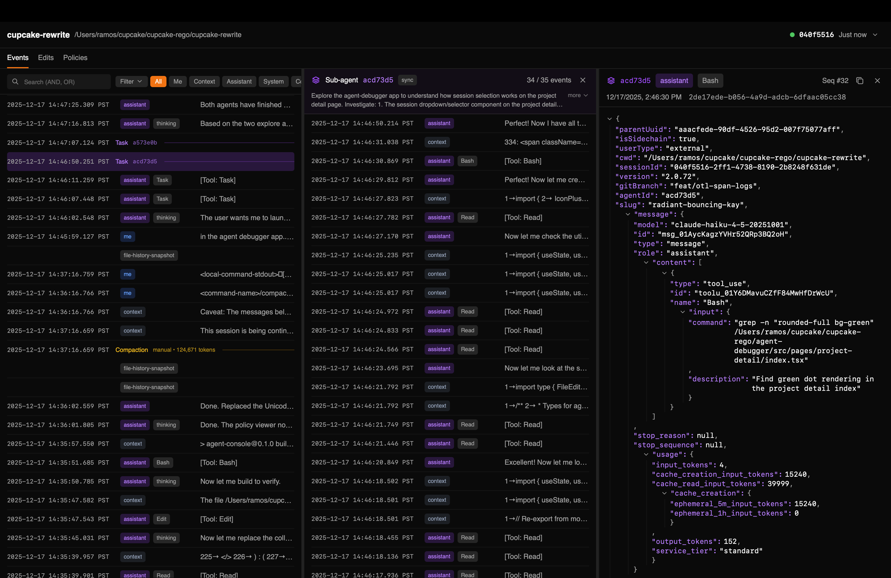
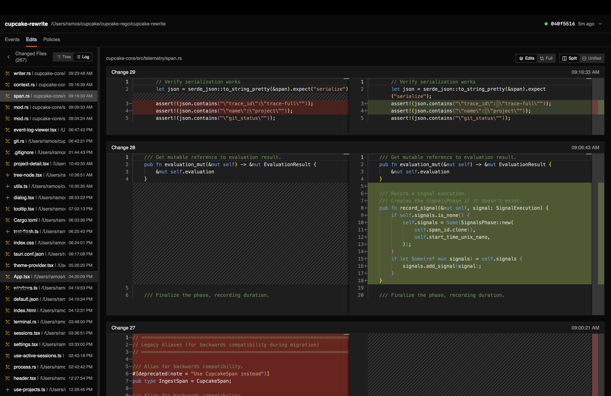
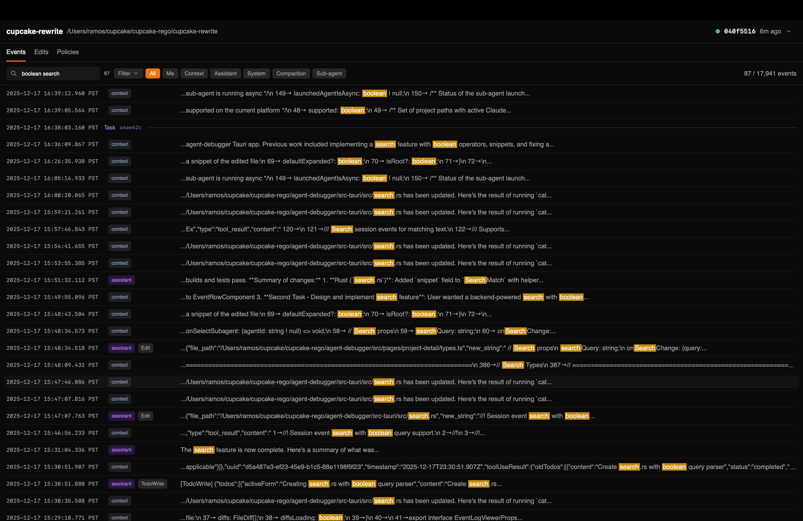
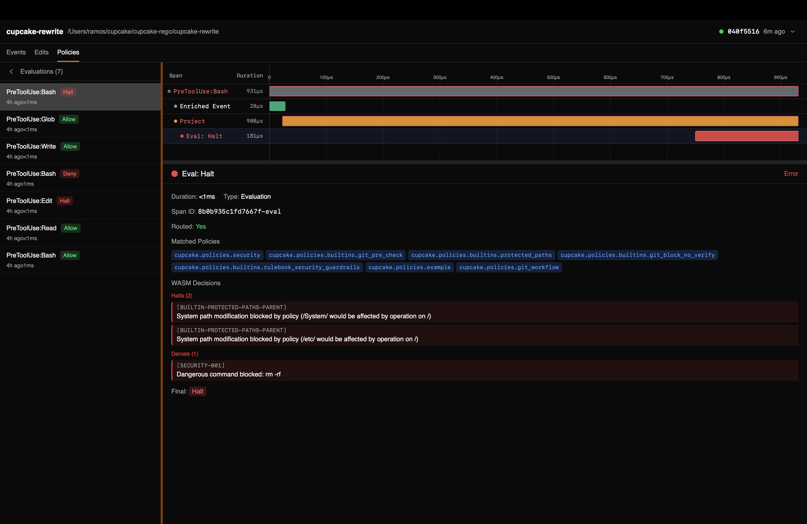

# Agent Console (for Claude Code)

Inspect event logs, view file edits, search conversations, and analyze policy evaluations.

### Event Logs

Browse the full conversation history with timestamps. Filter by event type (me, context, assistant, system), drill into sub-agent sessions, and inspect raw JSON.



### File Edits

See every file change made during a session. Toggle between tree and log views, view side-by-side or unified diffs, and compare against git HEAD.



### Boolean Search

Search across the entire session with AND/OR operators. Matching terms are highlighted in context snippets.



### Policy Viewer

Visualize [Cupcake](https://github.com/eqtylab/cupcake) policy evaluations with timing traces. See which policies matched, what decisions were made (Allow, Deny, Halt), and why.



---

## Getting Started

### Prerequisites

- [Rust](https://rustup.rs/) (stable)
- [Bun](https://bun.sh/)

### Install Dependencies

```bash
bun install
```

### Development

```bash
bun run tauri dev
```

### Build

```bash
bun run tauri build
```

The built app will be in `src-tauri/target/release/bundle/`.
